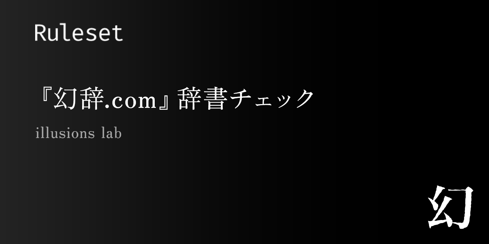

<div align="center">
  
  <h1>幻辞 — 未知語チェック</h1>
  <p><strong>illusions</strong> 校正ルールセット ／ <code>com.illusions-lab.genji-vocab</code></p>
</div>

『幻辞.com』の語彙データベース（[Genji](https://github.com/illusions-lab/Genji)）に
**未収録の語**を形態素解析で見つけ出し、エディタ上に控えめな `info` 提示します。
誤字・誤変換・タイプミス、そして辞書に載っていない造語・固有名詞の **発見** に役立ちます。

> [!NOTE]
> このルールセットは幻辞（Genji）辞書を必要とします（`requires: dict:genji`）。
> 辞書は illusions の **デスクトップ版（Electron）** で利用できます。Web 版では動作しません。

---

## 何をするルールセットか

収録ルールは 1 つ — **`genji-out-of-dict`（未知語の検出, L2）** です。

kuromoji のトークンから **内容語** を取り出し、その見出し語が幻辞辞書に含まれるかを照合します。
含まれていない語に青色の波線（`info`）を引きます。

| 品詞 | 照合に使う形 |
| --- | --- |
| 名詞（固有名詞を含む） | 表層形 |
| 動詞 / 形容詞 | 基本形（終止形） |

検査対象外：助詞・助動詞・記号・数・代名詞・非自立語・接尾辞、および純 ASCII（英単語・数字・記号）。

```
彼は図書館で本を読んだ。   → 指摘なし（すべて収録語）
彼は圕で本を讀んだ。       → 「圕」「讀む」を指摘（辞書外）
```

## 誤検出しない設計

辞書照合は非同期、校正実行は同期です。このギャップを埋めるため、illusions は各バッチの前に辞書
メンバーシップを **事前照合（prewarm）** し、その結果（スナップショット）を本ルールへ渡します。

- 本ルールがフラグするのは **「事前照合済みかつ未収録」** の語だけです。
- 事前照合されなかった語は `lookupCached` が `undefined` を返すため **スキップ** され、決して
  誤って「辞書外」と判定しません。
- 辞書が未インストール／破損／`dict.ready === false` のときは **何も検出しません**
  （全語を辞書外と誤判定する事故を防ぎます）。

詳しい挙動は [docs/rules/genji-out-of-dict.md](./docs/rules/genji-out-of-dict.md) を参照してください。

## オプション

`defaultConfig.options`（illusions の設定 UI から変更可能）:

| キー | 既定 | 説明 |
| --- | --- | --- |
| `includeProperNouns` | `true` | 固有名詞（人名・地名など）を検査対象に含める |
| `includeVerbsAdjectives` | `true` | 動詞・形容詞を基本形で検査する |
| `minLength` | `1` | この文字数未満の語を検査しない |

小説では人名・地名が辞書外になりがちです。固有名詞のノイズが多いと感じたら
`includeProperNouns` を `false` にしてください。

`applicableModes` は **空** です。固有名詞を含む性質上ノイズになり得るため、校正モード切替で
自動有効化はせず、ユーザーが任意に有効化する設計です。

## インストール（デスクトップ版）

ビルド成果物（`dist/index.js` + `manifest.json`）を illusions の
`~/.illusions/rulesets/com.illusions-lab.genji-vocab/` に置くと読み込まれます。

または [Releases](https://github.com/illusions-lab/illusions-ruleset-genji-vocab/releases) から
配布物（`com.illusions-lab.genji-vocab-vX.Y.Z.zip`）を取得し、同じフォルダに展開してください。

幻辞辞書が未ダウンロードの場合、illusions は本ルールを自動的に無効化し、日本語の警告を 1 回表示します。

## 開発

```bash
npm install
npm run check     # validate + typecheck + test + build
npm test          # vitest（positive→0 / negative→≥1 のゴールデン）
npm run build     # dist/index.js を生成（配布は build:min を推奨）
```

| パス | 役割 |
| --- | --- |
| `manifest.json` | ルールセットのメタ（コード非実行で読まれる純データ） |
| `src/index.ts` | `default export: RulesetModule` |
| `src/rules/genji-out-of-dict.ts` | ルール本体 |
| `src/lib/dict-candidate-terms.ts` | トークン → 照合見出し語の抽出ロジック |
| `test/genji-out-of-dict.test.ts` | ゴールデンテスト |
| `types/illusions-lint-sdk.d.ts` | SDK 型契約（`import type` 専用にベンダリング） |

> SDK は **`import type` のみ**。`illusions-lint-sdk` から値を import しないでください。
> 基底クラスと道具（`dict` など）は必ず実行時に `ctx` 経由で受け取ります。

## リリース

`v*` タグを push すると `.github/workflows/release.yml` が `dist/index.js` と `manifest.json` を
ビルドして GitHub Release に添付します。`manifest.json` の `engineApi` は illusions 本体の
`ENGINE_API_VERSION`（現在 **1**）と一致させてください。一致しないルールセットは隔離されます。

## ライセンス

[MIT](./LICENSE)。利用規約は [TERMS.md](./TERMS.md) を参照してください。
辞書データ（幻辞 / Genji）のライセンスは [Genji リポジトリ](https://github.com/illusions-lab/Genji) に従います。
</content>
</invoke>
